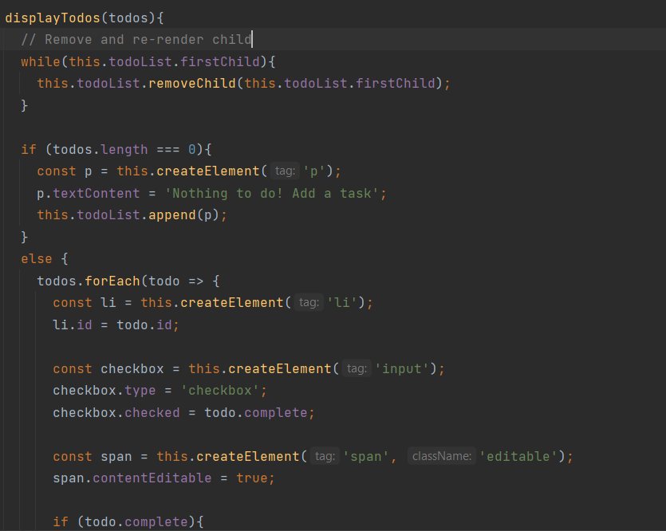

# [ToDo App MVC](https://www.taniarascia.com/javascript-mvc-todo-app/)
Một project đơn giản gồm: mô hình mvc, localstorage, object binding.
Nguồn: [taniarascia](https://github.com/taniarascia/mvc)

## Tại sao cần frontend framework như React, Vue, Angular
- Tái sử dụng cho các component
- Clean code
- Nhanh gọn

Trong project này đã sử dụng createElement để tạo ra các element nhằm mục đích tái sử dụng, tuy nhiên các element này chỉ là các component mặc định trong html như h1, p, ul,... Khi các component trên nên phức tạp hơn thì việc tái sử dụng như trong project trên sẽ vô cùng phức tạp.

## Bug performance:
- Xóa và re-render lại các todo không cần thiết: Hàm displayTodos sẽ xóa tất cả child element bên trong nó và render lại toàn bộ nếu có thay đổi

